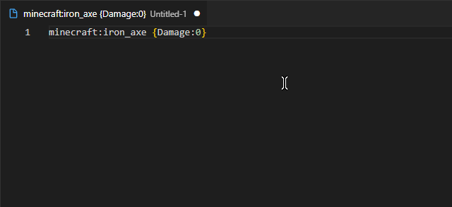

# tell-me-my-items README

Intellisense for Minecraft items via a json file.

Use the minecraft mod to generate the json:  
https://www.curseforge.com/minecraft/mc-mods/tell-me-my-items

## Features

- Autosuggest
- Command: reload from json
- Command: disable suggestions

## Requirements

You must use the MC mod to generate a json file, there are none provided by default.

## Extension Settings

Configure the tmmi.path preference to point to the json correctly.

## Known Issues

It's always suggesting.

## Release Notes

### 1.0.0

Initial release, woot!